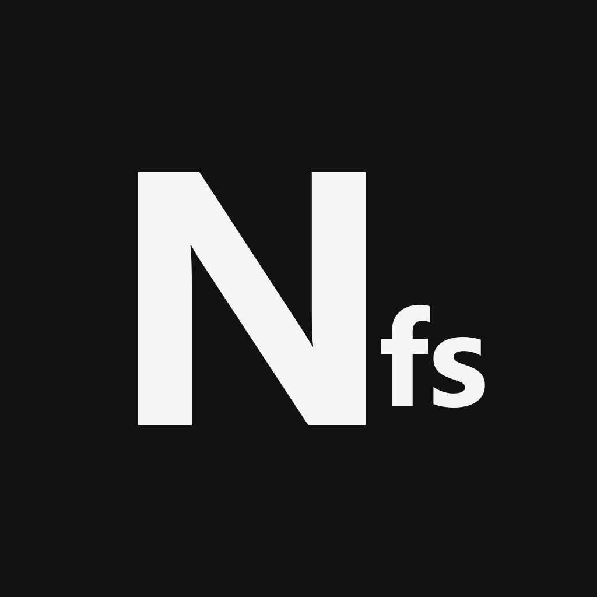

  

<h1 align="center">NotesFS</h1>

App móvil personal para el control de la escuela — horario, notas de clase, tareas, proyectos y fotos, todo en un solo lugar y <b>100% local</b> (sin backend, sin cuenta, sin nube).

Proyecto personal, no comercial — construido para uso propio y compartido con un grupo cercano de amigos para feedback. Documentado como parte de mi portafolio. El repositorio se llama `AppEscolar`; "NotesFS" es solo el nombre que aparece bajo el ícono en el teléfono.

## Qué hace

- **Horario de clases** como pantalla principal — clase actual/siguiente en tiempo real, horario completo editable, con márgenes y separación visual pulidos.
- **Notas de clase** organizadas por materia, con plantillas rápidas (examen, duda, tarea), fechas destacadas y búsqueda por texto.
- **Tareas** con título y descripción — apoyo visual para no depender de papel, sin fricción de marcar "hecho" (la entrega real es por Microsoft Teams).
- **Proyectos** largos con entregas parciales (hitos).
- **Fotos de notas**, comprimidas automáticamente al guardar.
- **Recordatorios** vía notificaciones locales del sistema — sin servidor, sin push.
- **Gestión de semestres** — archivar, exportar y borrar de forma manual, nada se pierde solo.
- Colores e ícono personalizables (varias opciones de color semilla + modo claro/oscuro/sistema).

## Stack

Flutter (Dart) · SQLite local (`drift`) · `flutter_local_notifications` · CI/CD con GitHub Actions (build de Android + iOS sin firmar, sin depender de una Mac)

## Estado

✅ **MVP completo** — las 5 features están construidas, con pulido visual y pipeline de distribución funcionando de punta a punta (build → instalación real en dispositivo).

- [`AGENTS.md`](./AGENTS.md) — contexto técnico completo del proyecto (punto de entrada para cualquier sesión de IA que retome el código).
- [`docs/decisiones.md`](./docs/decisiones.md) — el razonamiento detrás de cada decisión, no solo el qué.
- [`docs/esquema.md`](./docs/esquema.md) — modelo de datos completo.
- [`docs/instalacion.md`](./docs/instalacion.md) — cómo instalarla (Android directo, iPhone vía SideStore, sin Mac ni costo).
- [`docs/publicar-nueva-version.md`](./docs/publicar-nueva-version.md) — runbook para sacar una build nueva.

## Por qué es así

Es una app pensada para uso diario real en salón de clases (wifi poco confiable), por eso todo funciona offline. No es un gestor de tareas tradicional — no pide marcar nada como "hecho" porque eso ya se resuelve en otra plataforma; aquí solo es apoyo para no perder de vista lo pendiente. Sin Mac disponible para desarrollar, así que la distribución a iPhone se resuelve 100% desde GitHub Actions + SideStore, sin pagar la cuota de Apple Developer Program.
